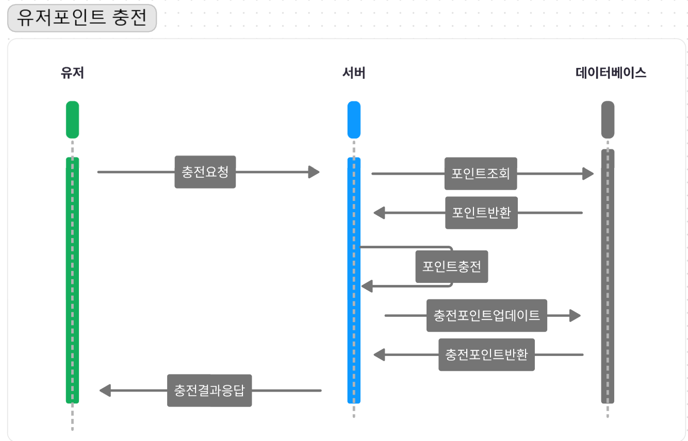
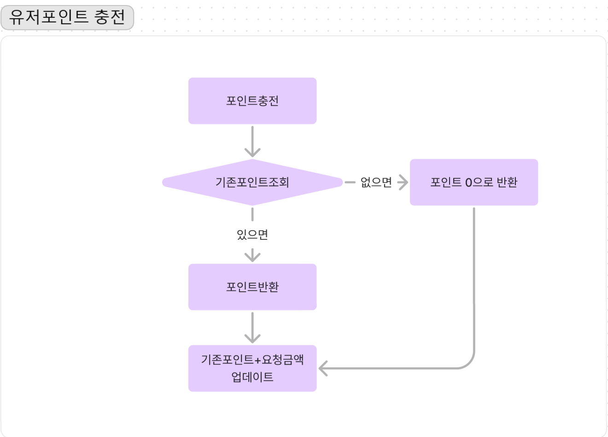
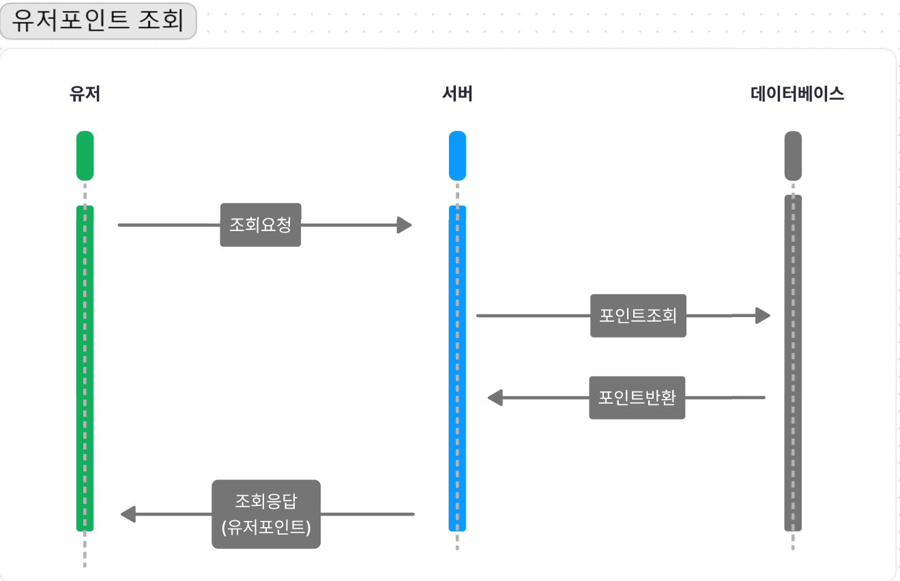
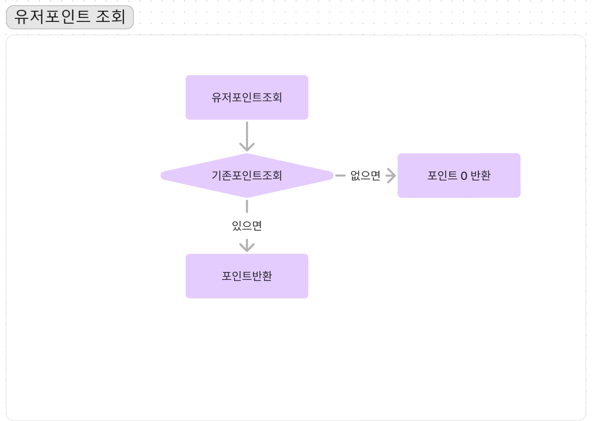
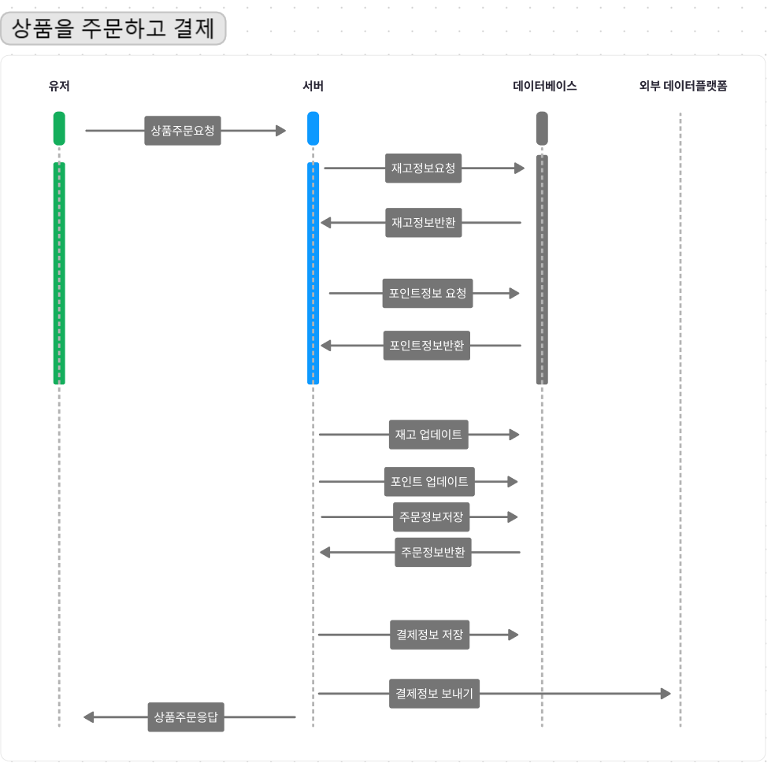

# `e-커머스 상품 주문 서비스`

## 마일스톤
~~요구사항분석~~(~4.3)
- 플로우차트~ing
- 시퀀스다이어그램(~ing)
- api설계(~ing)
- erd설계(~ing)
- 도메인설계(~ing)
- Mockapi
- 각 기능구현 및 제약사항에 대해 단위 테스트
- 동시성테스트-비관

## 요구사항분석
# 흐름도 &시퀀스다이어그램






### 포인트
[포인트 충전]
- 사용자 식별자 및 충전할 금액을 받아 포인트를 충전합니다.
[포인트 조회]
- 사용자 식별자를 통해 해당 사용자의 포인트를 조회합니다.
[포인트 사용]
- 사용자 식별자 및 사용할 금액을 받아 포인트를 사용합니다.

### 상품
[상품조회]
- 이커머스 상품 정보 ( ID, 이름, 가격, 잔여수량 ) 을 조회합니다.
- 조회시점의 상품별 잔여수량이 정확하면 좋습니다.

### 주문
[상품주문]
- 사용자 식별자와 (상품 ID, 수량) 목록을 입력받아 주문하고 결제를 수행합니다.
- 사용자는 상품을 여러 개 선택해 주문할 수 있고, 미리 충전한 잔액을 이용합니다.
- 동시에 여러 주문이 들어올 경우, 유저의 보유 잔고에 대한 처리가 정확해야 합니다.
- 각 상품의 재고 관리가 정상적으로 이루어져 잘못된 주문이 발생하지 않도록 해야 합니다.

### 결제
[상품결제]
- 결제는 기 충전된 잔액을 기반으로 수행하며 성공할 시 잔액을 차감해야 합니다.
- 데이터 분석을 위해 결제 성공 시에 실시간으로 주문 정보를 데이터 플랫폼에 전송해야 합니다. 
- 데이터 플랫폼이 어플리케이션 `외부` 라는 가정만 지켜 작업해 주시면 됩니다
- 데이터 플랫폼으로의 전송 기능은 Mock API, Fake Module 등 다양한 방법으로 접근해 봅니다.

### 분석
[인기판매상품조회]
- 최근 3일간 가장 많이 팔린 상위 5개 상품 정보를 제공합니다.
- 통계 정보를 다루기 위한 기술적 고민을 충분히 해보도록 합니다.
- 상품 주문 내역을 통해 판매량이 가장 높은 상품을 추천합니다.

### 장바구니
- 사용자는 구매 이전에 관심 있는 상품들을 장바구니에 적재할 수 있습니다.
- 사용자는 장바구니에 상품을 추가 혹은 변경할 수 있습니다.
- 시용자는 장바구니에 있는 상품들을 삭제할수 있습니다.
- 사용자는 모든 장바구니 상품목록을 볼 수 있습니다.

## API 설계
### 포인트
[포인트충전 API]
- 사용자의 포인트를 충전합니다.
- endpoint : patch /api/point/charge


[포인트조회 API]
- 사용자의 포인트를 조회합니다.
- endpoint : get /api/point/{memberId}

### 이커머스 상품
[상품 조회 API]
- 이커머스의 상품을 조회합니다.
- endpoint : get /api/product

### 주문
[주문 API]
- 상품을 주문 및 결제합니다.
- 상품이 결제가 되면 주문상태를 저장합니다.
- endpoint : post /api/order

### 결제
[결제 API]
- 상품을 결제요청합니다.
- endpoint : post /api/pay

### 통계
[인기 판매 상품 조회 API]
- endpoint : get /api/popular/product

### 장바구니
[장바구니 조회 API]
- 사용자의 장바구니 상품목록을 조회합니다.
- endpoint : get /api/cart
[장바구니 수정 API]
- 사용자의 장바구니 상품을 수정합니다.
- endpoint : get /api/cart
[장바구니 삭제 API]
- 사용자의 장바구니 상품을 삭제합니다.
- endpoint : get /api/cart
- Query Parameters: x
- Request Body:
```json
{
}
```
Response:
- 성공시
```json
{
}
```
- 실패시-조건
```json
{
}
```

# ERD
## DDL
```sql
-- 사용자포인트
CREATE TABLE ecommerce_user_point (
                                      user_point_id BIGINT AUTO_INCREMENT PRIMARY KEY COMMENT '인조키',
                                      member_id BIGINT NOT NULL COMMENT '회원 ID',
                                      user_point_point BIGINT NOT NULL COMMENT '사용자 포인트',
                                      user_point_pointAction VARCHAR(255) COMMENT '포인트 액션 (충전, 사용)',
                                      CONSTRAINT fk_userpoint_member FOREIGN KEY (member_id) REFERENCES member(member_id)
) COMMENT='사용자 포인트 정보';

-- 회원정보
CREATE TABLE member (
    member_id BIGINT AUTO_INCREMENT PRIMARY KEY COMMENT '인조키',
    user_id VARCHAR(255) NOT NULL UNIQUE COMMENT '사용자 ID',
    pw VARCHAR(255) NOT NULL COMMENT '사용자 비밀번호',
    nickName VARCHAR(255) NOT NULL COMMENT '사용자 닉네임',
    member_role VARCHAR(255) COMMENT '사용자 역할'
) COMMENT='회원 정보';

--상품정보
CREATE TABLE product (
                         product_id BIGINT AUTO_INCREMENT PRIMARY KEY COMMENT '인조키',
                         product_name VARCHAR(255) NOT NULL COMMENT '상품 이름',
                         product_price INT NOT NULL COMMENT '상품 가격',
                         delFlag BOOLEAN DEFAULT FALSE COMMENT '삭제 여부'
) COMMENT='상품 정보';

--재고정보
CREATE TABLE stock (
                       stock_id BIGINT AUTO_INCREMENT PRIMARY KEY COMMENT '인조키',
                       product_id BIGINT NOT NULL COMMENT '상품 ID',
                       stock_quantity BIGINT NOT NULL COMMENT '재고 수량',
                       CONSTRAINT fk_stock_product FOREIGN KEY (product_id) REFERENCES product(product_id)
) COMMENT='재고 정보';

-- 장바구니 정보
CREATE TABLE cart (
                      ecommerce_cart_id BIGINT AUTO_INCREMENT PRIMARY KEY COMMENT '인조키',
                      member_id BIGINT NOT NULL COMMENT '회원 ID',
                      CONSTRAINT fk_cart_member FOREIGN KEY (member_id) REFERENCES member(member_id)
) COMMENT='장바구니 정보';

-- 장바구니 항목
CREATE TABLE cart_item (
                           ecommerce_cart_item_id BIGINT AUTO_INCREMENT PRIMARY KEY COMMENT '인조키',
                           product_id BIGINT NOT NULL COMMENT '상품 ID',
                           cart_id BIGINT NOT NULL COMMENT '카트 ID',
                           cart_quantity INT NOT NULL COMMENT '카트 내 상품 수량',
                           CONSTRAINT fk_cartitem_product FOREIGN KEY (product_id) REFERENCES product(product_id),
                           CONSTRAINT fk_cartitem_cart FOREIGN KEY (cart_id) REFERENCES cart(ecommerce_cart_id)
) COMMENT='장바구니 항목';

-- 결제정보
CREATE TABLE ecommerce_payment (
                                   ecommerce_payment_id BIGINT AUTO_INCREMENT PRIMARY KEY COMMENT '인조키',
                                   member_id BIGINT NOT NULL COMMENT '회원 ID',
                                   ecommerce_payment_paymentMoney BIGINT NOT NULL COMMENT '결제 금액',
                                   ecommerce_payment_date_time DATETIME NOT NULL COMMENT '결제 날짜와 시간',
                                   ecommerce_payment_status VARCHAR(255) COMMENT '결제 상태',
                                   CONSTRAINT fk_payment_member FOREIGN KEY (member_id) REFERENCES member(member_id)
) COMMENT='결제 정보';

-- 주문정보
CREATE TABLE ecommerce_order (
                                 ecommerce_order_id BIGINT AUTO_INCREMENT PRIMARY KEY COMMENT '인조키',
                                 member_id BIGINT NOT NULL COMMENT '회원 ID',
                                 ecommerce_order_date DATE NOT NULL COMMENT '주문 날짜',
                                 product_id BIGINT NOT NULL COMMENT '상품 ID',
                                 ecommerce_quantity BIGINT NOT NULL COMMENT '주문 수량',
                                 status VARCHAR(255) COMMENT '주문 상태',
                                 CONSTRAINT fk_order_member FOREIGN KEY (member_id) REFERENCES member(member_id),
                                 CONSTRAINT fk_order_product FOREIGN KEY (product_id) REFERENCES product(product_id)
) COMMENT='주문 정보';


```
