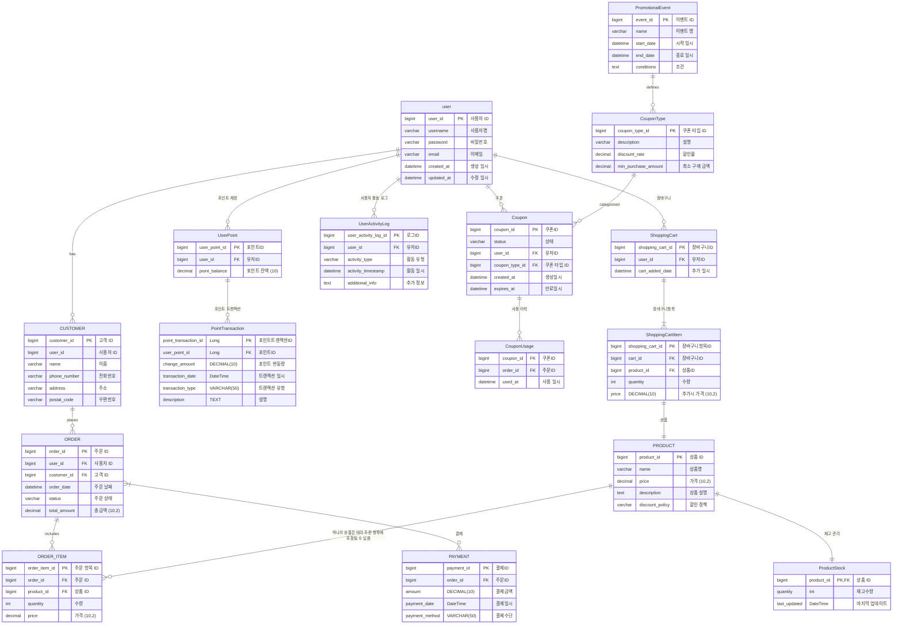

# `e-커머스 상품 주문 서비스`

# api desc
[스웨거 링크](https://kabalport.github.io/ecommerce/)
docs폴더에 스웨거공식 깃레포를 가져와 압축을 풀어서 깃헙페이지로 배포하였습니다.

# erd

```mermaid
erDiagram
    user {
        bigint user_id PK "사용자 ID"
        varchar username "사용자명"
        varchar password "비밀번호"
        varchar email "이메일"
        datetime created_at "생성 일시"
        datetime updated_at "수정 일시"
    }

    CUSTOMER {
        bigint customer_id PK "고객 ID"
        bigint user_id "사용자 ID"
        varchar name "이름"
        varchar phone_number "전화번호"
        varchar address "주소"
        varchar postal_code "우편번호"
    }

    ORDER {
        bigint order_id PK "주문 ID"
        bigint user_id FK "사용자 ID"
        bigint customer_id FK "고객 ID"
        datetime order_date "주문 날짜"
        varchar status "주문 상태"
        decimal total_amount "총금액 (10,2)"
    }

    ORDER_ITEM {
        bigint order_item_id PK "주문 항목 ID"
        bigint order_id FK "주문 ID"
        bigint product_id FK "상품 ID"
        int quantity "수량"
        decimal price "가격 (10,2)"
    }

    PRODUCT {
        bigint product_id PK "상품 ID"
        varchar name "상품명"
        decimal price "가격 (10,2)"
        text description "상품 설명"
        varchar discount_policy "할인 정책"
    }
    	ProductStock {
        bigint product_id PK,FK "상품 ID"
        quantity Int "재고수량"
        last_updated DateTime "마지막 업데이트"
    }
    
    UserPoint {
        bigint user_point_id PK "포인트ID"
        bigint user_id FK "유저ID"
        decimal point_balance "포인트 잔액 (10)"
    }

   PointTransaction {
        point_transaction_id Long PK "포인트트랜잭션ID"
        user_point_id Long FK "포인트ID"
        change_amount DECIMAL(10) "포인트 변동량"
        transaction_date DateTime "트랜잭션 일시"
        transaction_type VARCHAR(50) "트랜잭션 유형"
        description TEXT "설명"
    }
    

    

Coupon {
        bigint coupon_id PK "쿠폰ID"
        varchar status "상태"
        bigint user_id FK "유저ID"
        bigint coupon_type_id FK "쿠폰 타입 ID"
        datetime created_at "생성일시"
        datetime expires_at "만료일시"
    }

    CouponUsage {
        bigint coupon_id FK "쿠폰ID"
        bigint order_id FK "주문ID"
        datetime used_at "사용 일시"
    }

    CouponType {
        bigint coupon_type_id PK "쿠폰 타입 ID"
        varchar description "설명"
        decimal discount_rate "할인율"
        decimal min_purchase_amount "최소 구매 금액"
    }

    PromotionalEvent {
        bigint event_id PK "이벤트 ID"
        varchar name "이벤트 명"
        datetime start_date "시작 일시"
        datetime end_date "종료 일시"
        text conditions "조건"
    }
    
    PAYMENT {
        bigint payment_id PK "결제ID"
        bigint order_id FK "주문ID"
        amount DECIMAL(10) "결제금액"
        payment_date DateTime "결제일시"
        payment_method VARCHAR(50) "결제수단"
    }
    UserActivityLog {
        bigint user_activity_log_id PK "로그ID"
        bigint user_id FK "유저ID"
        varchar activity_type "활동 유형"
        datetime activity_timestamp "활동 일시"
        text additional_info "추가 정보"
    }
    
  ShoppingCart {
        bigint shopping_cart_id PK "장바구니ID"
        bigint user_id FK "유저ID"
        datetime cart_added_date "추가 일시"
    }
        ShoppingCartItem {
        bigint shopping_cart_id PK "장바구니항목ID"
        bigint cart_id FK "장바구니ID"
        bigint product_id FK "상품ID"
        int quantity "수량"
        price DECIMAL(10) "추가시 가격 (10,2)"
   }


    user ||--o{ CUSTOMER : "has"
    user ||--o{ UserActivityLog : "사용자 활동 로그"
    CUSTOMER ||--o{ ORDER : "places"
  

    ORDER ||--o{ ORDER_ITEM : "includes"
	  PRODUCT ||--o{ ORDER_ITEM  : "하나의 상품은 여러 주문 항목에 포함될 수 있음"
    PRODUCT ||--|| ProductStock : "재고 관리"  
    ORDER }|--o{ PAYMENT : "결제"
        
        
    user ||--o{ UserPoint : "포인트 계정"
    UserPoint ||--o{ PointTransaction : "포인트 트랜잭션"
    user ||--o{ Coupon : "쿠폰"
    Coupon ||--o{ CouponUsage : "사용 이력"
    CouponType ||--o{ Coupon : "categorized"
    PromotionalEvent ||--o{ CouponType : "defines"
    
        user ||--o{ ShoppingCart : "장바구니"
    ShoppingCart ||--|{ ShoppingCartItem : "장바구니항목"
    ShoppingCartItem ||--|| PRODUCT : "상품"
```
