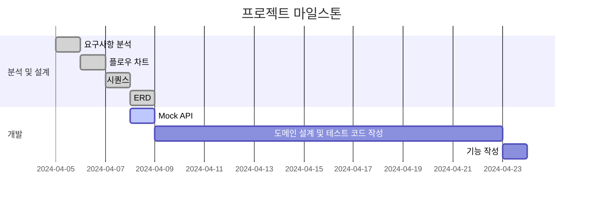
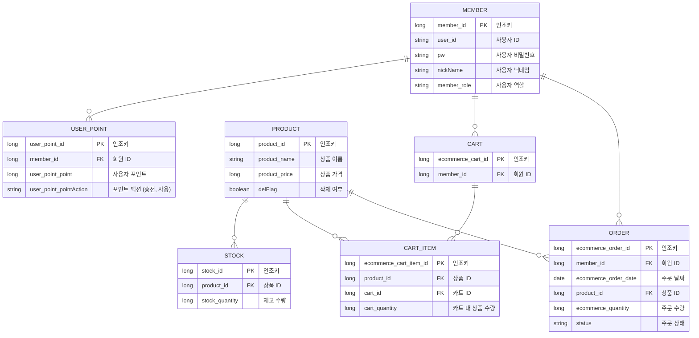
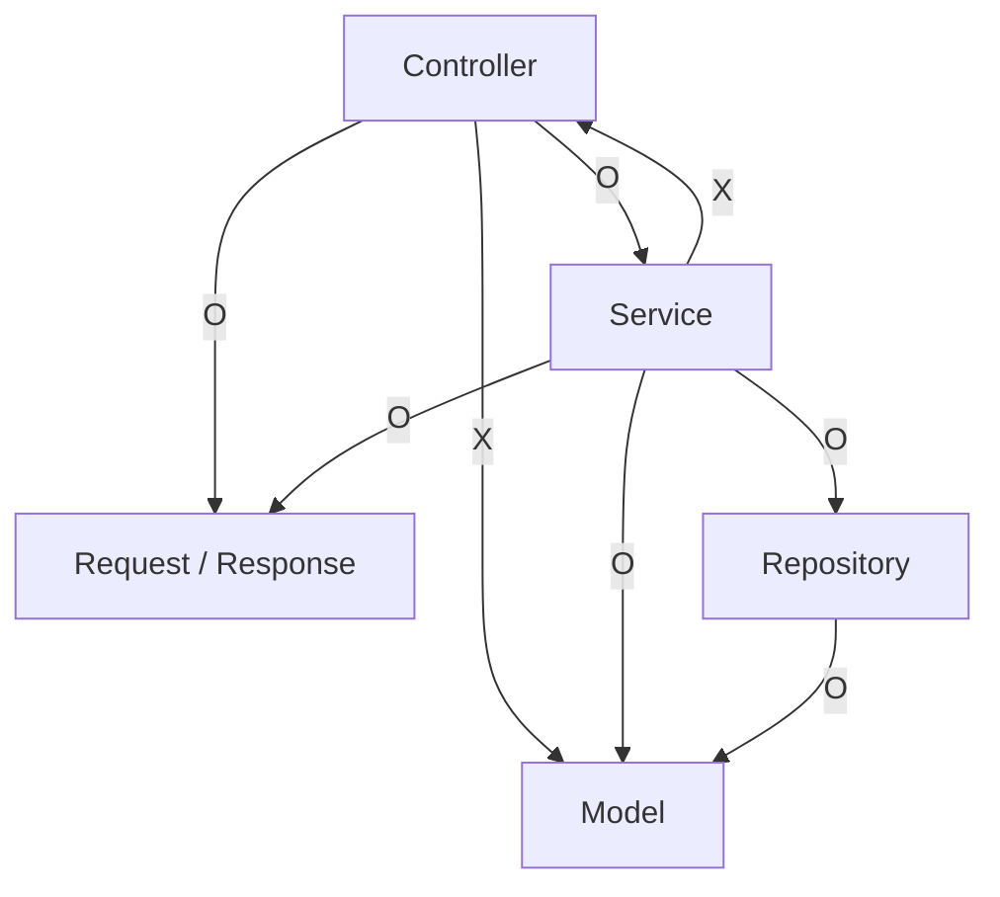
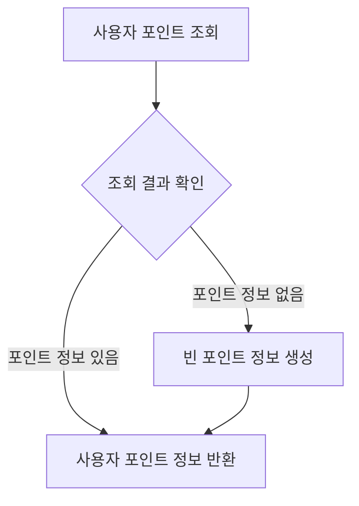
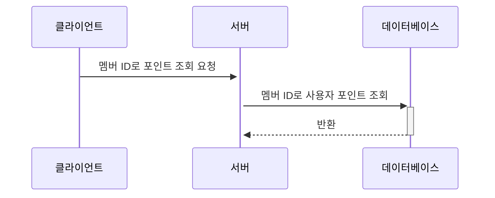
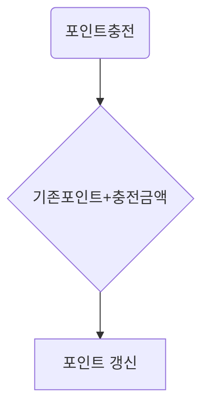
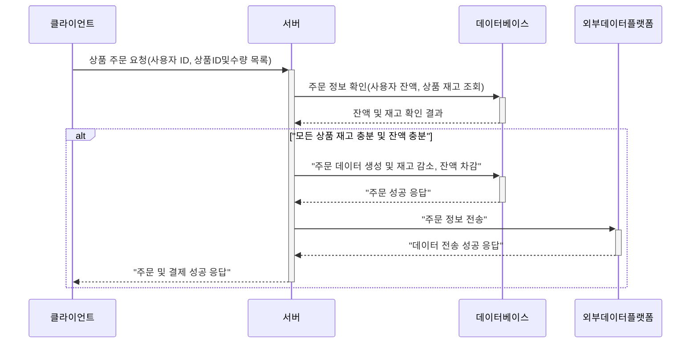

# `e-커머스 상품 주문 서비스`
설계문서 위치 
https://www.notion.so/637c45e66cf248239c745f9a1cf0f137


[사용해봐야 하는것]
- 깃허브 위키
- 깃허브 이슈
- 깃허브 마일스톤

[깃허브 위키]
문서 마이그레이션
문서폴더 원본두기


# `e-커머스 상품 주문 서비스`

# 마일스톤



# 요구사항분석

- 잔금을 조회합니다.
- 잔금을 충전합니다.
- 상품을 주문합니다.
- 상품주문시 잔금으로 구매합니다.
- 상품주문시 결제정보를 외부데이터 플랫폼에 보낸다는 가정을 합니다.

# ERD



# 코드 아키텍처



# 요구사항 분석

### 유스케이스

- 포인트 조회
- 포인트 충전

### 다이어그램(플로우차트,시퀀스다이어그램)

포인트 조회 : 사용자 식별자를 통해 해당 사용자의 포인트를 조회합니다.





포인트충전 : 사용자 식별자 및 충전할 금액을 받아 포인트를 충전합니다.



상품주문

- 사용자의 상품을 주문하고 결제하고 외부데이터플랫폼에 주문정보를 전송합니다.
- 사용자 식별자와 (상품 ID, 수량) 목록을 입력받아 주문하고 결제를 수행합니다.
- 사용자는 상품을 여러 개 선택해 주문할 수 있고, 미리 충전한 잔액을 이용합니다.
- 동시에 여러 주문이 들어올 경우, 유저의 보유 잔고에 대한 처리가 정확해야 합니다.
- 각 상품의 재고 관리가 정상적으로 이루어져 잘못된 주문이 발생하지 않도록 해야 합니다.
- 결제는 기 충전된 잔액을 기반으로 수행하며 성공할 시 잔액을 차감해야 합니다.
- 데이터 분석을 위해 결제 성공 시에 실시간으로 주문 정보를 데이터 플랫폼에 전송해야 합니다.
- 데이터 플랫폼이 어플리케이션 `외부` 라는 가정만 지켜 작업해 주시면 됩니다
- 데이터 플랫폼으로의 전송 기능은 Mock API, Fake Module 등 다양한 방법으로 접근해 봅니다.



[상품조회]

- 이커머스 상품 정보 ( ID, 이름, 가격, 잔여수량 ) 을 조회합니다.
- 조회시점의 상품별 잔여수량이 정확하면 좋습니다.
  [인기판매상품조회]
- 최근 3일간 가장 많이 팔린 상위 5개 상품 정보를 제공합니다.
- 통계 정보를 다루기 위한 기술적 고민을 충분히 해보도록 합니다.
- 상품 주문 내역을 통해 판매량이 가장 높은 상품을 추천합니다.
  [장바구니 목록보기]
- 사용자는 모든 장바구니 상품목록을 볼 수 있습니다.
  [장바구니 추가]
- 사용자는 구매 이전에 관심 있는 상품들을 장바구니에 적재할 수 있습니다.
  [장바구니 수정]
- 사용자는 장바구니에 상품을 추가 혹은 변경할 수 있습니다.
  [장바구니 삭제]
- 시용자는 장바구니에 있는 상품들을 삭제할수 있습니다.

## API 설계

### 포인트

[포인트충전 API]

- 사용자의 포인트를 충전합니다.
- endpoint : patch /api/point/charge

[포인트조회 API]

- 사용자의 포인트를 조회합니다.
- endpoint : get /api/point/{memberId}

### 이커머스 상품

[상품 조회 API]

- 이커머스의 상품을 조회합니다.
- endpoint : get /api/product

### 주문

[주문 API]

- 상품을 주문 및 결제합니다.
- 상품이 결제가 되면 주문상태를 저장합니다.
- endpoint : post /api/productOrder

### 결제

[결제 API]

- 상품을 결제요청합니다.
- endpoint : post /api/pay

### 통계

[인기 판매 상품 조회 API]

- endpoint : get /api/popular/product

### 장바구니

[장바구니 조회 API]

- 사용자의 장바구니 상품목록을 조회합니다.
- endpoint : get /api/cart
  [장바구니 수정 API]
- 사용자의 장바구니 상품을 수정합니다.
- endpoint : get /api/cart
  [장바구니 삭제 API]
- 사용자의 장바구니 상품을 삭제합니다.
- endpoint : get /api/cart
- Query Parameters: x
- Request Body:

```json
{
}

```

Response:

- 성공시

```json
{
}

```

- 실패시-조건

```json
{
}

```

# erd

`상품`
→  `상품 정보`  : 상품을 나타내는 정보들을 하나의 테이블에 응집시킨다.
→  `상품 옵션`  : 각 상품 옵션은 동일한 상품 정보를 가질 것이므로 상품 정보의 Id 를 통해 연관된 상품 정보를 알 수 있도록 구성한다.
→  `상품 재고`  : 재고 검증, 차감, 추가 등의 로직을 위해 배타적 Lock 을 이용한다면 상품 정보를 위한 조회에서도 영향을 받을 수도 있으므로 별도로 분리해낸다.